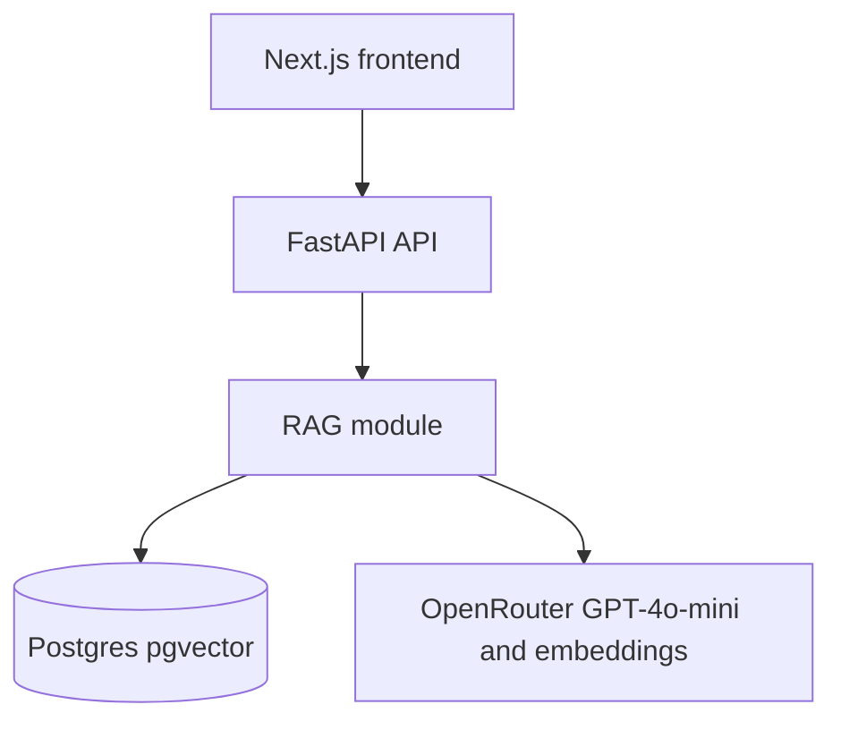

# AI HR Agent — Backend

FastAPI + pgvector API for a multi-tenant, document-grounded HR assistant. A company uploads its HR policies; employees ask questions in English, Urdu, or Roman Urdu; answers come only from that company's documents, with source citations.

The frontend (Next.js) lives in a separate repo and talks to this API over HTTP.

## Architecture



- **API** (`app/api/`): authentication, document ingestion, chat, tenant-scoped retrieval. HTTP controllers stay thin.
- **RAG** (`app/rag/`, `app/services/`): extract → clean → chunk → embed → pgvector. Questions retrieve the top company-scoped chunks and send only that context to the chat model. Kept separate from HTTP so future tools/integrations can be added without rewriting retrieval.
- **Postgres + pgvector**: stores companies, users, documents, chunks, conversations, and embeddings.

## RAG pipeline

### Ingestion

1. Admin uploads a PDF or DOCX.
2. The API validates type, magic bytes, and size (10 MB).
3. The document is stored with status `UPLOADED`, then processed in a background task.
4. Text is extracted. PDF page numbers are preserved.
5. Text is cleaned and split into overlapping chunks.
6. Embeddings are generated with `openai/text-embedding-3-small`.
7. Chunks are stored in `document_chunks` with `company_id`.
8. The document is marked `READY`, or `FAILED` with a reason.

### Retrieval

1. The employee's question is embedded.
2. pgvector cosine similarity search runs with `WHERE company_id = current company`.
3. Weak matches below `SIMILARITY_FLOOR` are dropped.
4. The top K chunks are sent to the chat model as context.
5. The model must answer from those excerpts only, in the same language as the question (English, Urdu, or Roman Urdu). If they are not enough, it tells the employee to contact HR.
6. The API returns the answer plus sources (`document`, `page`).

### Why pgvector

Embeddings stay next to the tenant data in Postgres. Every retrieval query can enforce `company_id` in SQL, which is the isolation boundary. No separate vector vendor is required for the MVP.

### How the chat model is used

GPT-4o-mini (via OpenRouter) never sees another company's documents. It receives a strict system prompt plus the retrieved excerpts. It is instructed not to invent policies, not to use general HR knowledge, to match the user's language exactly, and to abstain when the context is insufficient.

## Multi-tenancy

| Table | Tenant key |
| --- | --- |
| `users` | `company_id` |
| `documents` | `company_id` |
| `document_chunks` | `company_id` and `document_id` |
| `conversations` | `company_id` and `user_id` |

The company id always comes from the authenticated session, never from the request body. Company A cannot retrieve Company B's chunks. Row-level security on documents, chunks, conversations, and messages is a second tenant-isolation backstop.

Roles:

- **ADMIN** — upload, view, and delete documents; create employees; use chat.
- **EMPLOYEE** — use chat and view their own conversations. Admin-only documents are excluded from retrieval.

## Security

- Passwords hashed with bcrypt
- JWT in an httpOnly cookie
- File type, magic-byte, and size validation
- Auth and admin guards
- Tenant-scoped queries plus Postgres RLS
- Chat and auth rate limiting
- API keys stay on the server
- No raw user input in SQL
- Retrieved document text is treated as untrusted data in the prompt

## Deferred

Durable document-ingestion queues (Celery/Redis workers) are intentionally out of scope for this MVP. Uploads still process in an in-process FastAPI `BackgroundTasks` job. If a process restarts mid-ingest, the document can remain `PROCESSING` until it is re-uploaded. Move to a durable queue when ingestion volume or restart safety becomes a requirement.

## Local setup

```bash
cp .env.example .env
# set OPENROUTER_API_KEY and JWT_SECRET

python3 -m venv .venv
source .venv/bin/activate
pip install -r requirements.txt

docker compose up db -d
python -m app
```

API runs at [http://localhost:3004](http://localhost:3004).

Seed the Acme Technologies demo company + fixture policies (requires an OpenRouter key):

```bash
python -m app.seed
```

Demo accounts:

- Admin: `admin@acme.test` / `AcmeAdmin123!`
- Employee: `employee@acme.test` / `AcmeEmployee123!`

Tests (no database or LLM required):

```bash
python -m pytest -q
```

Full backend stack (Postgres + API) in Docker:

```bash
docker compose up --build
```

## Environment variables

| Variable | Purpose |
| --- | --- |
| `OPENROUTER_API_KEY` | Chat and embedding requests |
| `OPENROUTER_MODEL` | Chat model, default `openai/gpt-4o-mini` |
| `OPENROUTER_EMBEDDING_MODEL` | Embedding model, default `openai/text-embedding-3-small` |
| `DATABASE_URL` | Postgres connection string |
| `JWT_SECRET` | Signs session tokens |
| `JWT_TTL_HOURS` | Session lifetime |
| `COOKIE_SECURE` | Set `true` behind HTTPS |
| `ENVIRONMENT` | `development` or `production` (enables stricter runtime checks) |
| `PORT` | API port, default `3004` |
| `CORS_ORIGINS` | Allowed browser origins (the frontend URL) |
| `CHUNK_SIZE` | Chunk length in characters |
| `CHUNK_OVERLAP` | Overlap between chunks |
| `RETRIEVE_TOP_K` | Number of chunks sent to the chat model |
| `SIMILARITY_FLOOR` | Drop weak retrieval matches |
| `MAX_UPLOAD_BYTES` | Upload size limit |
| `CHAT_RATE_LIMIT_PER_MINUTE` | Chat throttle per session |
| `AUTH_RATE_LIMIT_PER_MINUTE` | Login/register throttle |
| `SEED_ON_START` | Create the Acme demo company if missing |

Never expose `OPENROUTER_API_KEY` to a browser.

## Deployment

1. Provision Postgres 16 with the `vector` extension.
2. Set production secrets (`OPENROUTER_API_KEY`, `JWT_SECRET`, `COOKIE_SECURE=true`, `ENVIRONMENT=production`).
3. Run `python -m app` or build the included Dockerfile. Schema is applied on first boot.
4. Set `CORS_ORIGINS` to the deployed frontend URL.

## Project structure

```
app/
  api/           HTTP layer. v1/ holds route modules; router.py mounts them
  core/          Settings, passwords, JWT, rate limits
  db/            Postgres pool, tenant connections, schema.sql
  schemas/       Request and response models, one module per feature
  services/      Business logic (auth, documents, chat)
  rag/           Chunking, extraction, embeddings, retrieval, prompting
fixtures/        Fictional Acme HR policies (demo seed data)
tests/           Auth, isolation, ingestion, RAG, rate limiting
```
